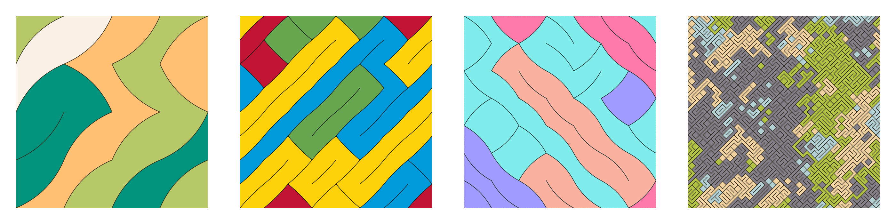

# Cushions

Cushions is a long-form generative art project by [Devi Parikh][devi] on [ArtBlocks][artblocks]. 

ArtBlocks is a generative art platform. Generative art "refers to art that in whole or in part has been created with the use of an autonomous system \[...\] that is generally \[...\] non-human and can independently determine features of an artwork \[...\]" ([Wikepedia][ga]). In most generative art, the non-human is the computer, and the autonomous process is randomness. On ArtBlocks, when someone is interested in buying a piece of art, they initiate a transaction. The hash of the transaction drives the randomness in the generative art system. A piece of art specific to that transaction is then generated.

Crucially, neither the buyer nor the artist know ahead of time which piece will be generated. There is no curation involved. So the generative art system must not only support a wide variety of pieces so that each piece is qualitatively different, it must also ensure high quality across these variations.

(As an aside, these aspects of long-form generative art have analogies to [computational creativity][cc] literature that often views creativity as a mix of novelty and quality. In fact, Wikipedia defines creativity as "a phenomenon whereby something new and valuable is formed".)

While it has come a long way since, the core idea behind Cushions started in 2018. Interestingly, even back then, it was a long-form generative art project (before [Tyler Hobbs popularized the term][lfga] in April 2021).

It was set up as a create-your-own interactive art generation tool where a user can set different features and make their own piece. It is still live [here][cyo] today. Every piece had to look good, irrespective of what parameters a user picked. Now on ArtBlocks, control is handed over not to another person, but to the randomness of a transaction hash!

## The Concept

The motivation behind the project was to explore the intersection of image processing techniques and ideas in generative art. 

Starting with a grid of randomly oriented diagonal lines (Truchet tiles), the concept shifts focus to the negative space that is created by the lines. Contiguous regions can be identified using connected component analysis, a classical technique in image processing. 

The grid of lines can have varying curvature, often giving regions the shape of cushions. Higher density grids with the diagonal curves biased in one direction lead to regions that resemble long Indian cushions (takiya) lined up.

All pixels in a region are colored the same color to highlight connected regions as a whole. 

Beauty often lives in our unique, individual oddities. To break the uniformity and add an element of imperfection, some regions may be rendered as a dark void. This gives the pieces an organic look within an otherwise crisp and structured design. 

These voids may contain an intricate texture that gives them a unique accent. The idea is that we should own, embrace, and leverage our individual oddities instead of shying away from them. 

Inspiration for the palettes ranges from digital illustrations and pastels to a nod to renowned artists and different ethnicities.

While subjective -- to the artist -- the shapes, palettes, voids, and textures come together in a wide variety of surprising ways. Some pieces evoke the semblance of fantastical dreams in starry nights. Some of the comfort and familiarity of home. Some of nostalgia and long-lost friends. Some of reasonable and grounded perspectives. Some of sparks, some of style, some of strength, and some of passion. Some of candy. Some of pop art. Some of modern interior design.

Several experiments with composition were promising but took away from the softness and cushion-y feel of the pieces. Experiments with matte colors also resulted in some intriguing effects, but eventually took away from the pop and digital illustration aesthetic. In the end, these were not incorporated in the final series, but are good seeds to potentially incorporate in future projects!

Random samples from the system are shown below and at the start of this article. The features that drive the variations in the pieces are described next.

## The Features

Cushions supports more than 5 billion possibilities across 13 features!

1. Scale indicates the density of the underlying grid. This takes 15 values: I, II, III, IV, V, VI, VII, VIII, IX, X, XI, XII, XIII, XIV, XV. 

2. Texture indicates the curvature of the lines. This takes 4 values: Straight, Wavy, Curvy, Coily.

3. Balance indicates whether the curves are biased in one direction or the other. This takes 5 values: Left, Left-tilt, Balanced, Right-tilt, Right

4. Strokes indicates the thickness of the curves. This takes 6 values: Fine, Thin, Solid, Thick, Chunky, Heavy

5. Style takes 2 values: Neutral, Ornamented. It indicates whether the curves are emphasized by a white-on-black contrast or not.

6. Palette indicates which hand-designed palette is used to color the piece. This takes 50 values: Pastel, Neon, Dream, Marshmallow, Meadow, Ethnic, Cake, Baby, Bright, Beach, Gradient, Cotton Candy, Journal, Authentic, Cartoon, Statement, Business, Salient, Primary, Home, Icing, Birthday, Grown Up, Core, Scheme, Activity, Pop, Wood, Mighty, Iconic, Potential, Gold, Insomnia, Safe, Surprise, Love, Deep, Basquiat, Dali, Gauguin, Lichtenstein, Monet, Munch, Rothko, Gogh, Warhol, Mondrian, Canna, Magritte, Truth.

7. Colorful indicates how many colors the piece has. This takes 4 values: Mono, Di, Tri, Tetra.

8. Colors indicates which color hues are used in the piece. Each palette has four colors in it. They are mapped to 4 spots on the cyan-to-red spectrum of hues. The color closest to cyan, closest to red, second closest to cyan, and second closest to red are identified. If a piece has one color, it can be the Cyanest, 2ndCyanest, 2ndReddest or Reddest color from the palette. If a piece has two colors, they can be the Cyanest+2ndCyanest, Cyanest+2ndReddest, Cyanest+Reddest, 2ndCyanest+2ndReddest, 2ndCynest+Reddest or 2ndReddest+Reddest colors. If a piece has three colors, they can be the Cynest+2ndCyanest+2ndReddest, Cynest+2ndCyanest+Reddest or 2ndCyanest+2ndReddest+Reddest colors. Finally, a piece may have All four colors. Overall, this feature takes 15 values.

9. Contrast indicates whether the color of the curves and void regions is black or a dark shade of one of the colors in the palette, making the piece more subtle. It takes 2 values: Black, Dark.

10. Composition indicates whether the piece has any void regions or not. It takes 2 values: Organic, Full.

11. Accent indicates the texture used in the void region (if present). It takes 14 values: Flat, Polka, Venn, Curtains, Bracelets, Plaid, Sparkles, Squares, Twirls, Flowers, Streams, Ribbons, Puzzle, Hills, and None (if there is no void).

12. Voidness indicates the size of the void. It takes 4 values: V- (if there is no void), V, V+, V++.

13. CutAcross indicates whether the void region (if present) has the grid of curves going through it to exaggerate the grid, or if the curves are suppressed to exaggerate the void. It takes 2 values: Yes, No.

As mentioned, Cushions supports more than 5 billion possibilities across these 13 features! Out of 1000 simulations, on average, two pieces have 4 out of the 13 features in common. Even in the very unlikely event that two pieces have all 13 features in common, the two pieces will very likely not be identical because there is additional randomness in the pieces driven by the hash beyond what the features control (e.g., the orientations of the individual curves, the color of the individual regions).

## The Artist

Devi Parikh is an AI researcher and a generative artist. She also makes [Macrame][macrame], [Origami][origami], and maintains a physical sketchbook with kawaii doodles, zentangles, mandalas, paper cutting and sketches. 

While evolving, her generative art so far has tended to have vibrant colors, geometric patterns, symmetries, and crisp textures co-existing with organic shapes. She gets inspiration from a variety of sources -- some mundane, some exotic; some traditional, some unexpected; some specific, some diffused -- colors in rare stones, textures in snake skins, graffiti, wall art, digital illustrations, acrylic pouring, mandalas, ethnic fabrics, looking out the window during a long taxi ride, Indian culture, or feedback from a trusted friend. She maintains an ever growing list of ideas -- ranging from small tweaks to an existing project to entirely new projects or styles. Her process involves starting with an idea, prototyping the core of it to see if it feels right, and then iterating, iterating, iterating. The joy and mystery is in seeing where the iterations lead!

She gets energy out of creative expression. Some of it through her art -- both digital and analog. Some of it through her research in AI. In fact, the two intersect -- part of her work is on developing AI that can enhance human creativity -- give people new tools for creative expression.

She was born in Tulsa, Oklahoma, USA. But you wouldn't guess from her name, how she looks, or how she sounds. She has lived in Riyadh, Saudi Arabia. She grew up in Ahmedabad, India. She currently lives in San Francisco, USA. She has an abysmal sense of space and orientation. She has an excellent sense of time. She hates small talk. She loves deep connections with people. She appeared in Forbes' list of 20 "Incredible Women Advancing A.I. Research". 

She has dabbled in sketching, painting, origami, dancing, music all her life -- she was decent at some of this, not so much at the rest :) She was first introduced to AI in 2003 in junior year of college and has worked in AI since. She was first introduced to generative art by a friend in 2018, when her day-job presented fewer opportunities to be hands-on with code. Generative art scratched the itch to code as well as explore AI for creativity.

Find out more about Devi's art at [http://stateoftheheart.ai/][soth]. You can also find her on [Twitter][tw], [Instagram][insta], [Foundation][fnd] and [fxhash][fxhash]. 

[artblocks]: https://www.artblocks.io/
[cyo]: https://cc.gatech.edu/~parikh/create_your_own/tiles_cushions.html
[lfga]: https://tylerxhobbs.com/essays/2021/the-rise-of-long-form-generative-art
[sketchbook]: https://www.cc.gatech.edu/~parikh/sketchbook.html
[macrame]: https://www.cc.gatech.edu/~parikh/macrame.html
[origami]: https://www.cc.gatech.edu/~parikh/origami.html
[soth]: http://stateoftheheart.ai/ 
[rorschach]: https://en.wikipedia.org/wiki/Rorschach_test
[pareidolia]: https://en.wikipedia.org/wiki/Pareidolia
[devi]: https://www.cc.gatech.edu/~parikh/
[tw]: https://twitter.com/deviparikh
[insta]: https://www.instagram.com/deviparikh/
[fnd]: https://foundation.app/@deviparikh
[fxhash]:  https://www.fxhash.xyz/u/Devi%20Parikh
[ga]: https://en.wikipedia.org/wiki/Generative_art
[cc]: https://en.wikipedia.org/wiki/Computational_creativity
